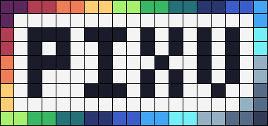
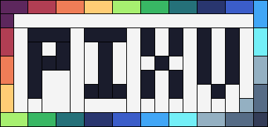

<div align="center">
    
    <p><i>Vectorize your pixel art</i></p>
</div>

# What?

A CLI tool for converting raster pictures into SVG. The tool can convert any PNG/JPEG images but the first priority is pixel art. Using photos or any other images with a high pixel density, a wide range of colors, or small chunks of adjacent pixels might not produce the desired result.

# Why?

Large amount of software processes raster images with interpolation. In other words application will try to make color transition between adjacent pixels. Usually, such behavior is undesirable with small sized images and especially pixel art pictures as they become blurry. To solve that problem you can use vectorized version of your image.

# How does it work?

There are several methods of vectorization you can use. They vary in speed, produced file structure and its size. Nevertheless they all use `<path/>` tag which allows to group all same colored shapes with fewest characters possible.

## Vectorization Algorithms

### Square

Simply draws square for each pixel from the image. Produces large sized files but with perfect pixel matrix.



### Rectangle

Combines adjacent pixels of the same color in rectangular chunks. Usually generated files are much smaller.



### Path

Draws path around chunks of the same color. The most efficient in terms of file size but has the slowest processing time.


## Size Comparison

```
pixv.png         268 bytes
--------------------------
Square          2577 bytes
Rectangle       1322 bytes
Path            1176 bytes
```

# How to use?

Following command will create svg variant of the given image in the current directory.

```
pixv image.png
```

You can use flags to customize the result

- `--method [method]`, `-m [method]` - Choose vectorization method. Accepts `square` or `rectangle`. Default method is `path`

- `--scale [multiplier]`, `-s [multiplier]` - Change the scale of the pixels. Currently accepts only `integers`. Default multiplier is `1`

For more information use `pixv help`

# How to build?

Make sure you have `Go` version 1.22.4 or higher.

Use following commands to build the project

```
git clone https://github.com/axseem/pixv.git
cd pixv
go build
```

