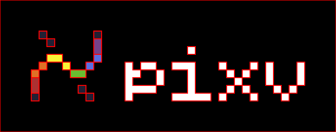

<div align="center">
    
    <p><i>Vectorize your pixel art</i></p>
</div>

# What?

A CLI tool for converting raster images into SVG. The tool can convert any PNG/JPEG image, but its primary focus is pixel art. Using photos or other images with high pixel density or a wide range of colors might not produce the desired result.

# Why?

Much of the software that displays raster images uses interpolation. This means applications try to create smooth color transitions between adjacent pixels. For small images, and especially pixel art, this behavior is often undesirable as it makes them blurry. Converting a pixel-art image to SVG solves this problem by defining shapes with sharp, scalable edges.

# How does it work?

There are several vectorization strategies. They vary in speed, produced file size, and structure. All strategies use the `<path/>` tag, which allows shapes to be described with the fewest characters possible.

## Vectorization Strategies

### Square

Simply draws a square for each pixel from the image. This method is very fast and produces a perfect pixel matrix, but the resulting file sizes are large.


### Rectangle

Combines adjacent pixels of the same color into rectangular chunks. Generated files are usually much smaller than the Square method, while still preserving great performance.


### Path

Traces the outline of same-colored shapes. This is the most efficient method in terms of file size but has the slowest processing time.



## Size Comparison

The [pixv logo](./docs/pixv.svg) is used for this comparison. Raster [images](./docs/) were exported from Krita, removing any metadata and always using lossless quality.

**Raster vs Vector**

```
 Scale       1x     8x    32x   128x 
-------------------------------------
 PNG       251B   734B   4.5K    51K 
 JPEG      1.2K   1.0K   9.7K   215K 
-------------------------------------
 SVG       1.3K   1.3K   1.3K   1.3K   
```

**Different Strategies**

```
 Scale                           Any 
-------------------------------------
 SVG(Path)                      1.3K 
 SVG(Rectangle)                 1.7K 
 SVG(Square)                    9.8K 
```

# How to use?

The following command will create an SVG variant of the given image in the current directory.

```
pixv image.png
```

For more information use `pixv --help`:

```
NAME:
   pixv - A CLI tool to vectorize pixel-art images

USAGE:
   pixv [global options]

VERSION:
   v0.3.0

AUTHOR:
   axseem: max@axseem.me

GLOBAL OPTIONS:
   --method string, -m string  Vectorization method: path, rectangle, or square (default: "path")
   --scale int, -s int         Scale multiplier for the output SVG (default: 1)
   --output string, -o string  Output file path. Defaults to input with .svg extension
   --help, -h                  show help
   --version, -v               print the version
```

# How to install?

```sh
# Nix
nix profile install github:axseem/pixv

# Go
go install github.com/axseem/pixv@latest
```

You can also run `pixv` directly from the GitHub repository without a permanent installation:

```sh
nix run github:axseem/pixv
```

# How to build?

```sh
git clone https://github.com/axseem/pixv.git
cd pixv
go build
```